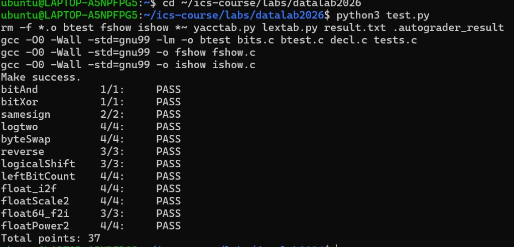

# datalab 报告

姓名：马浩翔

学号：2025200695

| 总分 | bitAnd | bitXor | samesign | logtwo | byteSwap | reverse | logicalShift | leftBitCount | float_i2f | floatScale2 | float64_f2i | floatPower2 |
| ---- | ------ | ------ | -------- | ------ | -------- | ------- | ------------ | ------------ | --------- | ----------- | ----------- | ----------- |
| 37   | 1      | 1      | 2        | 4      | 4        | 3       | 3            | 4            | 4         | 4           | 3           | 4           |

test 截图：

<!-- TODO: 用一张本地通过截图，放到 report/imgs 下，例如 imgs/test-pass.png -->



## 解题报告

### 亮点

1. logtwo
2. leftBitCount
3. byteSwap
### 函数解题思路：
### bitAnd

思路：利用德摩根律，~(~x | ~y)即可得出x&y， 实现按位与。

### bitXor

思路：列真值表，只需排除同为1和同为0的情况，即~(x & y) & ~(~x & ~y)。

### samesign

思路：先处理x或y为0的情况即!X-->!y；否则用算术右移31位取符号位，再异或、取非比较符号位。

### logtwo（亮点）

思路：题目即找最高位1所在的位置。使用二分法逐步定位1的位置：每次检查当前值的高一半是否有 1，如果有，就说明最高位在那一半，于是把 v 右移，继续检查剩下的部分。先看高 16 位是否为零，否-->右移以8为标准检查；是-->移位记录shift再依次判断8、4、2、1。这样不使用while循环，操作数也满足限制。

### byteSwap（亮点）

思路：字节下标乘8得到二进制码的位移，取出目标字节nm后通过掩码保留指定位置，从而通过mask交叉移位。自己第一次做的时候忘记了左移右移的算术意义，直接按照nm来移位了，导致第一遍很惨烈的错误。

### reverse

思路：把32位按比特逆序，只需要用`while(i)`循环 32 次，每次把v的最低位拼到结果低端并左移，再右移v，让下一次的第一位进入队列末尾

### logicalShift

思路：有符号数的>>为算术右移。先算术右移，再使用低32-n位为1的掩码，只保留目标位置。mask由1<<(31-n)变形得到，并写成31+（~n+1）实现取负数补码，同时单独处理n=0时补码越界的情况。

### leftBitCount（亮点）

思路：用二分法判断当前高16/8/4/2/1位是否全为连续1，是则计数加上相应宽度并左移递归看下一位，最后补上可能漏掉的一位。不是则不左移直接检查下一级颗粒度

### float_i2f

思路：返回一串有符号整数的IEEE754 32比特模式只需要分析其s,exp,frac。如果是0直接返回+0；用掩码取符号位与`~x+1`得到x绝对值；while循环找找最高位1直接求出exp；左移对齐保留低23位求出frac；根据第7位与尾数奇偶做round与后规格化，当尾数导致进位时exp加一。
第一次提交时因未声明s/a/e/frac变量导致编译失败，补上后通过。

### floatScale2

思路：计算2*f的位级结果，实现过程需要按指数分类：`exp==0xFF`（NaN/Inf）直接原样返回；`exp==0` 为非规格化类型，在尾数左移1位，并且检查是否变成规格化数；对规格化数乘2就是指数加 1，若指数达到0xFF则得到无穷。

### float64_f2i

```c
if (shift > 31) {
    val = hi >> (shift - 32);
} else {
    val = (hi << (32 - shift)) | (lo >> shift);
}
```

思路：将64位的高低32位比特分别转为32位整数来存储，拆求出s，exp，frac；E<0时直接返回0，exp=0x7FF或者E>30时表示Inf或Nan与溢出直接返回0x80000000。求53位有效数时hi在高位lo在低位，然后将有效数右移。右移的时候由于分成两部分，所以需要分情况讨论

### floatPower2

思路：直接分类讨论，x>127返回正无穷；x<-149返回0；-149≤x≤-127用非规格化尾数中的单比特if (x < -126) return 1 << (x + 149)表示；其余情况可采用规格化形式，直接(x+127)<<23。

## 反馈/收获/感悟/总结

这次实验我第一次在WSL里编译没有通过；原因是在float_i2f里直接使了`s/a/e/frac`但没有先声明变量，gcc报错为`undeclared`，在AI的解释下我补充了变量声明，完成了实验。这让我意识到，本学期课程习惯写伪代码，看着能跑的写法经常会因写法而报错，在课程指定的Linux/gcc环境下必须熟悉debug过程。
配置 WSL、Git、SSH 的过程也让我熟悉了从Windows到Linux的工作流。修改自己原版代码并与 AI 交互时，我更倾向于先让 AI 解释报错，和AI阐述我的原本思路，再自己动手改，这样既能通过测试，也真正理解了位运算和浮点表示。

## 参考的重要资料

- DataLab README 与 bits.c 题面注释

